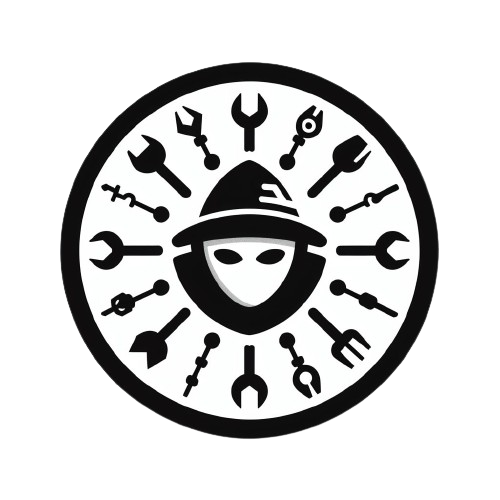

# SARF-Security-Assesment-and-Reporting-Framework

> This is currently an ALFA. It is a project that I imagined long ago and now I have begun to build.

## Index

- [What is this](#Detected-needs)
- [Project Docs](https://elchicodepython.github.io/SARF-Security-Assesment-and-Reporting-Framework/)
- [Installation](https://elchicodepython.github.io/SARF-Security-Assesment-and-Reporting-Framework/cli/quickstart.html#installation)
- [Roadmap](https://elchicodepython.github.io/SARF-Security-Assesment-and-Reporting-Framework/common/roadmap_2022.html#roadmap-2022)

## Detected needs

When I was working as an ethical hacker I began to notice a series of needs in
my day to day that this platform tries to solve.

- Need for custom vulnerability templates -> Status 100%
- Need for report templates and automatic report generation -> Status 20%
- Need for security assesment traceability -> Status 5%
- Need for tools interconnection -> Status 70%

## Sponsor this project

After several years designing the best architecture for the project as a
hobby, I have simplified many parts and for the first time it has become
feasible for a small team. This is going to be done and I would like it to be
an open source project.

A series of economic resources are necessary for building this so im currently
searching for sponsors.

Your company can benefit from the development of this tool and from the
advertisment of being a sponsor in the home page of the project.

If you just want to support the project without any kind of advertisement
for your company you can [Buy me a coffee](https://ko-fi.com/elchicodepython)
to make the project grow and keep me motivated.

If you want some kind of retrieval get in touch through
[Linkedin](https://es.linkedin.com/in/sam-sec) to sponsor
**SARF**
