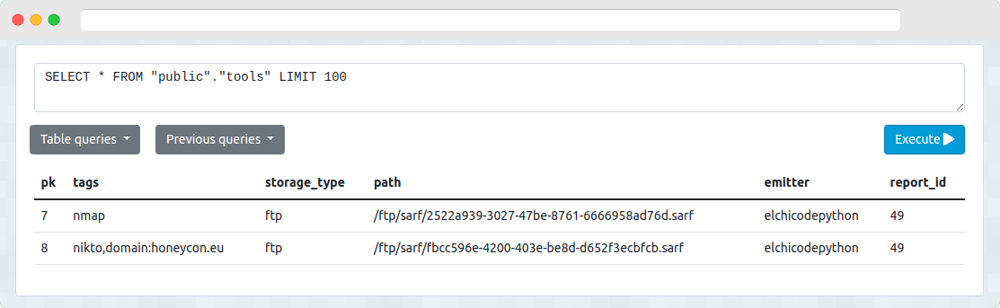
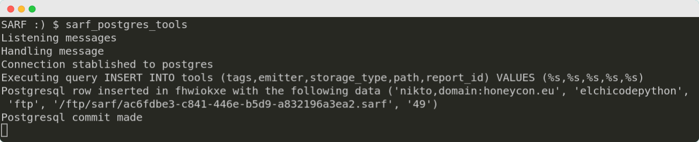

# Database listeners

## Postgresql Tools

This listener retrieve messages from SARF tools and write them into a Postgresql table.




### Installation

`pip install sarf_postgres_tools`

### Configuration

Configuration should be added inside /etc/sarf.config.yml.

```yaml
listeners:
  loglevel: 10
  logfile: /var/log/sarf/listeners.log

  # Specific postgres_tools listener configuration
  postgres_tools:
    host:
    port: 5432
    database:
    table:
    user:
    password:
    datamap:
      # key in message: column in database
      tags: tags
      emitter: emitter
      storage_type: storage_type
      path: path
      report_id: report_id

```

### Usage

`sarf_postgres_tools`


