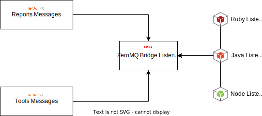
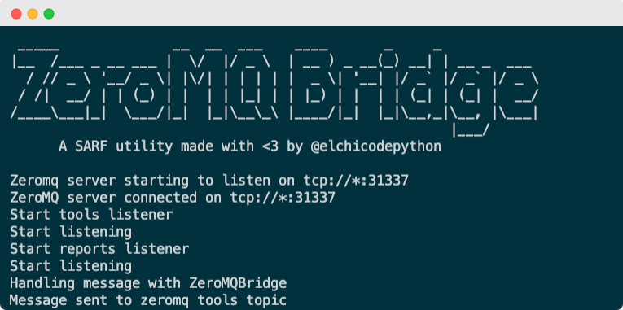

# Misc Listeners

## ZeroMQ Bridge Listener

The common communication interface between `SARF` messages
and other programming languages.

### Why

`SARF` is decoupled from the infrastructure it works with.
This allows you the flexibility to adapt `SARF` to many environments.

In python the added complexity is handled through a dependency injector.
This dependency injector takes care of using the
infrastructure pieces it needs based on the `SARF` configuration.

Extending `SARF` in Python is as simple as adding a new listener.
The dependency injector takes care of connecting it to the appropriate message
queue regardless of whether it is `rabbitmq`, `kafka` or any other.


- Connecting listeners from other programming languages directly to specific
    messages tool would create a coupling that would force you to use a particular
    type of infrastructure. This would also impact the extensibility of SARF by adding
    compatibility issues between listeners.

- Moving SARF's dependency injector logic to all languages in the world doesn't make sense.

> Therefore, a common communication interface is necessary.

### Description

`ZeroMQ Bridge Listener` is an adapter between `SARF` and `ZeroMQ` messages.
`ZeroMQ` is a very lightweight queuing protocol that supports pub-sub.

> Other languages can connect to ZeroMQ topics in order to extend SARF functionality



### Installation

```bash
pip install sarf_zeromq_bridge
```

### Configuration

Add zeromq_bridge conf inside `/etc/sarf/config.yml` listeners section.

```yaml
listeners:
  zeromq_bridge:
    port: 31337
```

### Run the listener

```bash
sarf_zeromq_bridge
```



### Extending SARF in other programming languages

The next example shows how to extend SARF functionality in `node.js` through `zeromq_bridge`.
The exposed `zeromq` port allows any programming language connect to `SARF message topics`.

```js
// poc.js
var zmq = require('zeromq')
  , sock = zmq.socket('sub');

sock.connect('tcp://127.0.0.1:31337');
console.log('Worker connected to port 31337');

sock.subscribe('tools');

sock.on('message', function(msg){
  console.log('work: %s', msg.toString());
});

```

```bash
~$ node poc.js
Worker connected to port 31337
work: tools {"emitter": "ethical hacker email or identifier", "project_id": "3a8bdee8-27ae-498c-ad2c-4f6a5d2f2fe7", "tags": ["tool:nmap", "network:192.168.1.0/24"], "storage_type": "ftp", "path": "/ftp/tools/d094b85e-6028-49d8-9c20-126277977841.sarf"}
```
